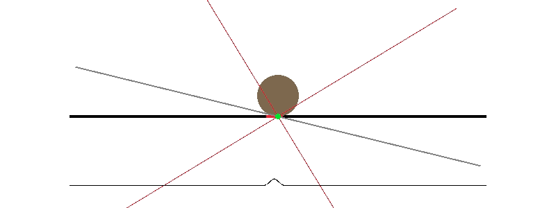

# Kalman filter for ball position on tilted resistive touch plane

This small project is a proof of concept of design and simulation of a simple Kalman filter to estimate the location of a ball on a titled resistive touch screen plane.

[](assets/demo.gif)

## Motivation
This is inspired by a friend's old project which involved controlling the position of a ball, rolling on a controllable tilted plane, by performing feedback on the error between the current position and the target one. The controller which was used is a simple PID controller.
The system is actuated by two stepper motors, one for each tilt axis of the plane. The position of the ball is measured with a resistive touch screen, which coincides with the tilted plane itself.

## Description
The main problem is that the ball, even if made out of metal and thus sufficiently heavy, is not always detected when rolling on the resistive touch surface. Moreover, when it is detected, the measured position is noisy.

Also, there is uncertainty about the actuation, since the stepper motors might "skip steps".

Filtering the touch screen data was originally performed in a very simple way, but I instead wanted to play around with a Kalman filter with the aim of improving the quality of the estimate.

We would like to estimate the position of the ball together with the current tilt angle of the plane, since the latter (due to missed steps) might not equal the cumulative commanded steps.
Intuitively speaking, we want a filter that:
- Considers the noisy measurements, when available, to update its estimate of the position of the ball
- Considers the noisy (due to missed steps) actuation commands to update its estimate of the tilt angle of the plane.
- Provides an estimate of the position even if measurements are not available. We might call these time intervals "blind". This should be possible, since we know physics laws and can predict how the system evolves. Recall that the tilt angle of the plane is known (as an estimated state variable), together with the velocity and the position of the ball, so these quantities can be used for this purpose.
- Corrects for the actuation errors by exploiting the fact that the acceleration of the ball is tied to the plane tilt. This means that the estimate of the tilt angle can be corrected/improved by using the acceleration estimate, which is available by double differentiation (with respect to time) of the position estimate.

A Kalman filter is able to perform this work.

## System modeling and filter design
Since GitHub Markdown doesn't support math equations, this section is described in [this PDF file](assets/modeling_and_design.pdf) inside the repository.

Note the following things:
- Only one tilt axis is modeled.
- The Kalman filter is not discussed, and I take for granted the ability to design a filter for a linear system.

## Simulation details
We briefly describe how the simulation is set up.

The titled plane, with the ball rolling over it, is drawn at the center of the viewport. 
A green dot on the plane represents a successful touch screen reading.

The non-linear system is simulated with a second order Runge-Kutta method.

### Touch screen simulation
The resistive touch screen readings are simulated by adding gaussian noise to the true value. Moreover their occasional unavailability is obtained by computing an estimated probability of detecting the ball. This quantity is assumed to decrease with the perpendicular component of the gravitational force. A penalty term proportional to this quantity is then included, together with a penalty term which is proportional to the ball speed. Whenever we need to simulate a measurement, we draw from a binomial distribution parametrized by this computed probability and only provide a value in case of success.

### Kalman filter estimate representation
The current estimated state is represented in various ways:
- The estimated position of the ball is drawn as a bold red segment on top of the plane. The extremes of the segment are tied to the error of the estimation (2σ confidence interval).
- The estimated tilt angle of the plane is drawn as a thin gray line, with the extremes of the 2σ confidence interval being represented as two thinner red lines.
- The gaussian probability density associated to the position estimate is also plotted below the tilted plane.

### Keyboard controls
The left and right arrow keys are used to change the plane tilt set point to +20° or -20°. A smooth change of the tilt angle is performed by a very simple proportional controller (which uses the true tilt angle, not the estimated one). Its output (which is the system input, i.e. the angular velocity of the tilt angle) is fed to the Kalman filter.

## Running instructions
[raylib](https://www.raylib.com/) is used for interactively drawing the simulation state. The library must be installed, since the [Python bindings](https://pypi.org/project/raylib/) depend on it.

The Python packages listed in the `requirements.txt` file (NumPy, SciPy and the raylib bindings) must be installed and available, then the simulation can be launched with

```console
$ python simulate.py
```
## Possible improvements and additional work

### Better input modeling for stepper motors
The system is currently modeled with its input being the angular tilt velocity of the plane. While this might be satisfactory at first, since the stepper motors can be driven at constant velocity, it may end up being not very accurate. Also the ZOH discretization might not be appropriate, since the number of steps performed during each discrete-time controller interval can be all over the place. A way around this issue could be to account for the system input directly in the discrete-time domain, defining the input at time `k` to be the number of steps performed since time `k - 1`.

### Better model of the actuation error, based on motor torque
It seems reasonable to assume that the actuation error, which is due to missed motor steps, depends on the required motor torque in a specific condition (think at the two extreme cases: the ball being at the center and the ball being at the edge of the plane, with the motor trying to lift it). The error could be better modeled, through some kind of identification procedure/experiment, so that this insight is exploited. This would imply the noise matrix `N` of the Kalman filter to be time varying, and more specifically to be based on the current state estimate.

### The filter is not an [Extended Kalman Filter](https://en.wikipedia.org/wiki/Extended_Kalman_filter)
This is a minor detail, but by definition the filter implemented here is not exactly an implementation of an EKF. The difference is in the time update step, where the EKF better exploits the model by evolving the state estimate with the "full" non-linear equations, while this implementation evolves the system state through an approximate dynamic obtained by the time discretization of the linearization around the current state estimate.

### Extension to two axes
While this work can be applied to the original two-axes system as is by running two separate instances of the filter, it might be better to model both tilt axes together in the same dynamical model. This would allow the filter to work with the covariances of the errors of the different state variables for both axes.

### C implementation
Since the filter would very likely run on a microcontroller, a C implementation is required. The automatic discretization, at each time step, should be obtained in closed-form. The benefit of using a single filter for both axes (which would imply a 9x9 state evolution matrix) should be weighted considering the additional computational time required, compared to the usage of two separate filters.

### Ball velocity reading
Modeling the system so that velocity readings of the ball are available (i.e. with a 2x3 `H` output matrix) might allow the filter to better correct the estimate of the tilt angle. The reason is that the discrete-time innovation (the difference between the estimated output and the measured output) would then include a quantity compatible with the acceleration of the ball (being the difference of two velocities after a fixed time step). Intuitively, this should be of great help for producing a linear correction (through the Kalman gain) of the estimated tilt angle.
